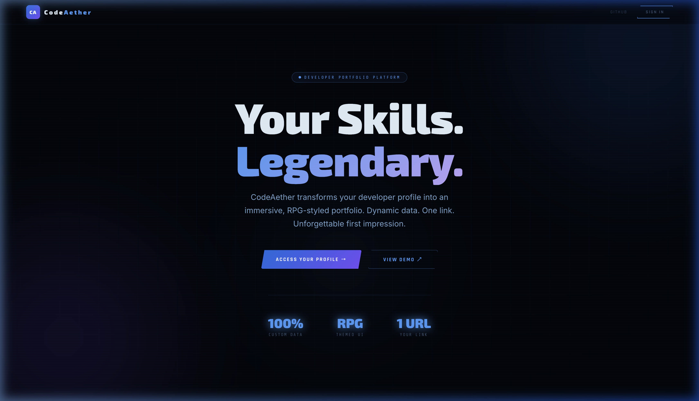
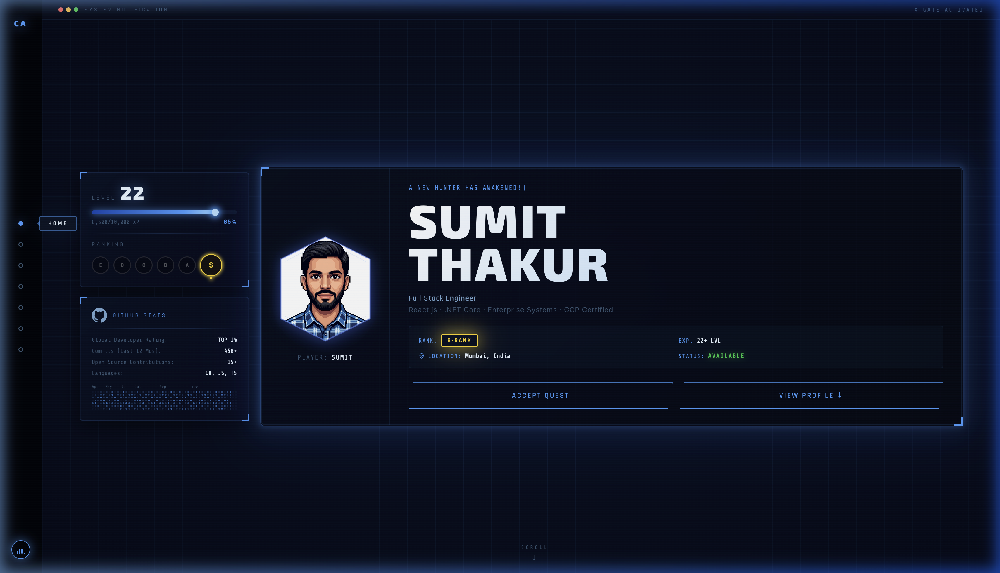
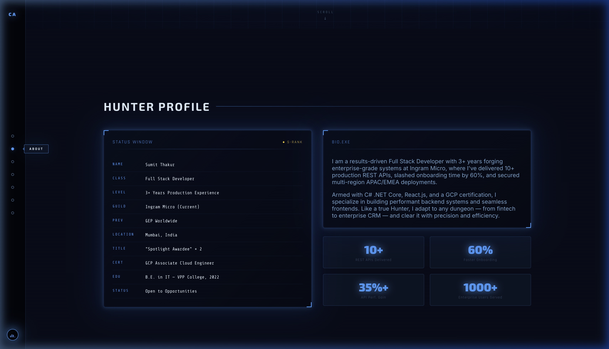
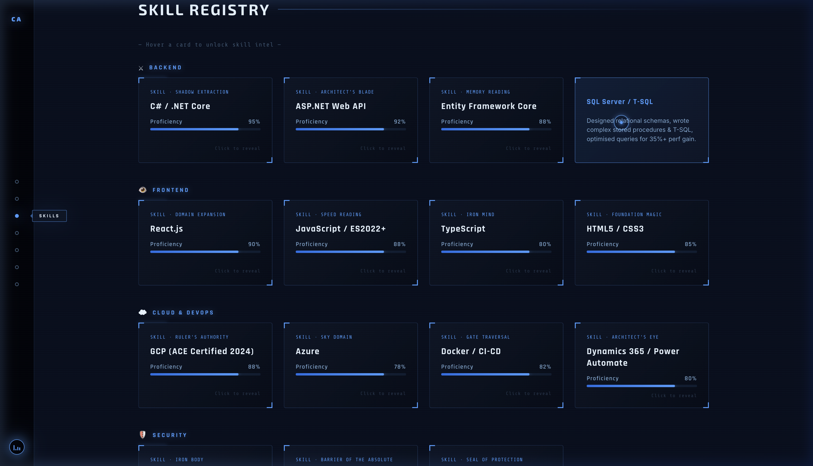
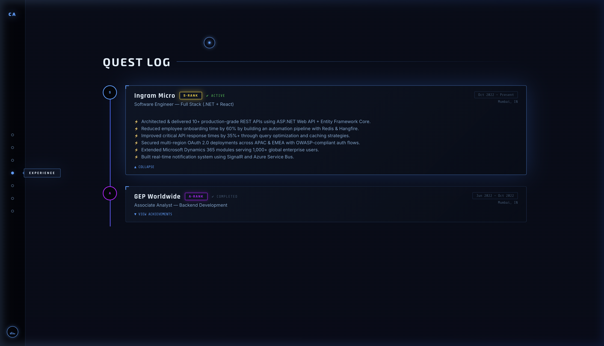
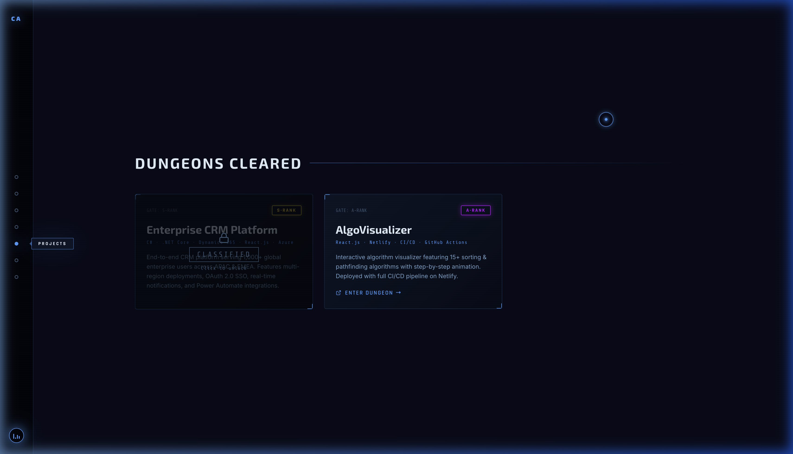
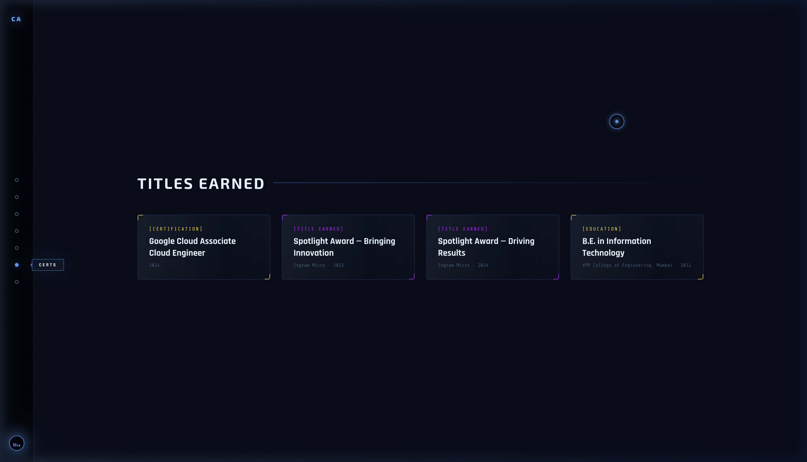
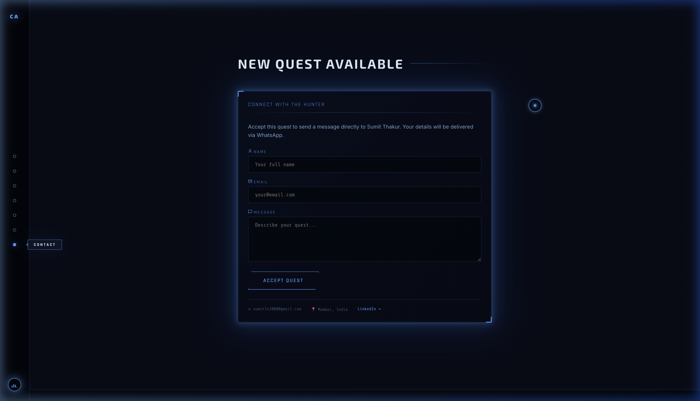

<div align="center">


# CodeAether

**The next-gen developer portfolio platform.**  
Transform your skills into a legendary, immersive RPG-styled profile — shareable at one URL.

[](https://codeaether.vercel.com)
[](https://react.dev)
[](LICENSE)

</div>

---

## 📸 UI Screenshots

### Landing Page — `codeaether.vercel.com`

*New Gen Minimal UI with animated ambient background, gradient headline, and sign-in CTA.*

### Hero Dashboard — `codeaether.vercel.com/sumit-thakur`

*RPG-styled profile dashboard with XP progress panel, GitHub stats, hexagonal avatar, and rank badge.*

### Hunter Profile (About)

*Status window with profile fields and a quick-stats grid — all loaded dynamically from JSON.*

### Skill Registry

*Flip cards per skill category (Backend, Frontend, Cloud, Security) with proficiency bars.*

### Quest Log (Experience)

*Timeline of work experience rendered as expandable quest entries with rank badges.*

### Dungeons Cleared (Projects)

*Project cards with classified overlay unlock on click, external link, and rank badges.*

### Titles Earned (Certifications)

*Gold and purple certification badges for awards, certs, and education.*

### New Quest Available (Contact)

*Validated contact form routed to the user's WhatsApp via CallMeBot API.*

---

## 🚀 Getting Started

### Prerequisites

| Tool | Version |
|------|---------|
| Node.js | 18+ (22.x recommended) |
| npm | 9+ |

### Local Development

```bash
# 1. Clone the repository
git clone https://github.com/S-Techofficial/Portfolio.git
cd Portfolio

# 2. Install dependencies
npm install

# 3. Set up environment variables (optional — see below)
cp .env.example .env.local

# 4. Start the dev server
npm run dev
```

Open **http://localhost:5173** → CodeAether landing page.  
Sign in with username `sumit-thakur` to view the demo portfolio.

### Environment Variables

```env
# .env.local
# WhatsApp contact form (via CallMeBot API)
# Leave blank in development — the form will simulate success
VITE_MY_WHATSAPP_NUMBER=91XXXXXXXXXX
VITE_CALLMEBOT_API_KEY=your_callmebot_key
```

> **Get your CallMeBot key:** Send "I allow callmebot to send me messages" to +34 644 26 33 43 on WhatsApp.

### Production Build

```bash
npm run build       # outputs to /dist
npm run preview     # preview the production build locally
```

---

## 🏗️ Architecture

### Routing Model

```
/              → LandingPage      (CodeAether home + auth modal)
/:username     → PortfolioPage    (RPG dashboard, data loaded per user)
/privacy-policy
/terms-of-use
/cookie-policy → Legal pages
```

User portfolios are served at `/{username}`. The username is used as a **slug** to fetch the user's JSON data file via a Vite dynamic import (code-split per user at build time).

### Data Flow

```
URL /:username
     │
     ▼
PortfolioPage.jsx
     │  calls fetchUser(slug)
     ▼
UserContext.jsx
     │  dynamic import('../data/users/{slug}.json')
     ▼
sumit-thakur.json (or any user's JSON)
     │
     ▼  (via useUser())
All Section Components
(HeroSection, AboutSection, SkillsSection, ...)
```

### Context Providers

| Context | File | Purpose |
|---------|------|---------|
| `AuthContext` | `src/context/AuthContext.jsx` | Mock sign-in/out with `sessionStorage` persistence |
| `UserContext` | `src/context/UserContext.jsx` | Loads + caches user profile JSON by slug |
| `AudioContext` | `src/context/AudioContext.jsx` | Ambient audio play/pause for the RPG theme |

---

## 📁 Project Structure

```
Portfolio/
├── public/
│   ├── favicon.svg              # CodeAether "CA" monogram SVG
│   ├── sumit_avatar.png         # User avatar image
│   ├── robots.txt
│   └── sitemap.xml
├── docs/
│   └── screenshots/             # UI screenshots (used in this README)
├── src/
│   ├── App.jsx                  # Root — providers + route tree
│   ├── main.jsx                 # React DOM entry point
│   │
│   ├── pages/
│   │   ├── LandingPage.jsx      # CodeAether homepage (/)
│   │   ├── PortfolioPage.jsx    # RPG dashboard (/:username)
│   │   └── legal/
│   │       ├── PrivacyPolicy.jsx
│   │       ├── TermsOfUse.jsx
│   │       └── CookiePolicy.jsx
│   │
│   ├── components/
│   │   ├── layout/
│   │   │   ├── Navigation.jsx   # Sidebar nav (desktop) + top bar (mobile)
│   │   │   ├── Footer.jsx       # Dynamic footer with user links
│   │   │   ├── LoadingScreen.jsx
│   │   │   ├── PageTransition.jsx
│   │   │   ├── SystemCursor.jsx # Custom RPG system cursor
│   │   │   └── CookieBanner.jsx
│   │   │
│   │   ├── sections/            # Portfolio content sections
│   │   │   ├── HeroSection.jsx
│   │   │   ├── AboutSection.jsx
│   │   │   ├── SkillsSection.jsx
│   │   │   ├── ExperienceSection.jsx
│   │   │   ├── ProjectsSection.jsx
│   │   │   ├── CertificationsSection.jsx
│   │   │   └── ContactSection.jsx
│   │   │
│   │   ├── ui/                  # Reusable RPG UI primitives
│   │   │   ├── XPProgressPanel.jsx   # Level + XP bar + rank ladder
│   │   │   ├── GitHubStatsPanel.jsx  # GitHub stats + contribution heatmap
│   │   │   ├── CharacterAvatar.jsx   # Hexagonal avatar frame
│   │   │   ├── SystemPanel.jsx       # Glass panel with corner brackets
│   │   │   ├── RankBadge.jsx         # E/D/C/B/A/S rank chips
│   │   │   ├── GlowButton.jsx        # Primary + secondary CTA buttons
│   │   │   ├── StatBar.jsx           # Proficiency progress bar
│   │   │   ├── SystemText.jsx        # Typewriter text effect
│   │   │   └── RevealOnScroll.jsx    # Scroll-triggered fade-in wrapper
│   │   │
│   │   └── three/               # Three.js cinematic hero background
│   │       ├── CinematicHeroBackground.jsx
│   │       ├── HeroScene.jsx
│   │       ├── DungeonGate.jsx
│   │       └── ParticleField.jsx
│   │
│   ├── context/
│   │   ├── AuthContext.jsx
│   │   ├── UserContext.jsx
│   │   └── AudioContext.jsx
│   │
│   ├── data/
│   │   ├── schema.js            # Enums, typedefs, defaults
│   │   └── users/
│   │       └── sumit-thakur.json  # User profile data
│   │
│   ├── hooks/
│   │   ├── useActiveSection.js  # Scroll-tracking for nav highlight
│   │   ├── useAmbientAudio.js
│   │   └── useMagneticHover.js
│   │
│   ├── styles/
│   │   ├── index.css            # CSS entry — imports all below
│   │   ├── globals.css          # Design tokens, reset, layout
│   │   ├── fonts.css            # Google Fonts preload
│   │   ├── animations.css       # Keyframe animations
│   │   ├── components.css       # All component-level styles (~52 kB)
│   │   ├── cinematic-hero.css   # Three.js hero section styles
│   │   └── landing.css          # Landing page styles
│   │
│   └── utils/
│       └── whatsapp.js          # CallMeBot WhatsApp dispatch utility
│
├── index.html                   # HTML entry — CodeAether meta/OG tags
├── vite.config.js
├── eslint.config.js
└── package.json
```

---

## 🧩 User Data Schema

All portfolio content is defined in a single JSON file per user. The schema is documented in [`src/data/schema.js`](src/data/schema.js).

```jsonc
// src/data/users/{username}.json
{
  "meta": {
    "username": "sumit-thakur",       // URL slug
    "displayName": "Sumit Thakur",
    "tagline": "Full Stack Engineer",
    "avatarUrl": "/sumit_avatar.png",
    "status": "available",            // "available" | "employed" | "not-looking"
    "theme": "solo-leveling"
  },
  "hero": {
    "alertText":  "A NEW HUNTER HAS AWAKENED!",
    "firstName":  "SUMIT",
    "lastName":   "THAKUR",
    "role":       "Full Stack Engineer",
    "stack":      "React.js · .NET Core · GCP Certified",
    "rank":       "S",                // E | D | C | B | A | S
    "level":      22,
    "xp":         { "current": 8500, "max": 10000 },
    "location":   "Mumbai, India"
  },
  "about": {
    "profileFields": [{ "key": "NAME", "val": "Sumit Thakur" }, ...],
    "bio":           ["Paragraph 1...", "Paragraph 2..."],
    "quickStats":    [{ "val": "10+", "label": "REST APIs Delivered" }, ...]
  },
  "skills": [
    {
      "category": "BACKEND",
      "icon": "⚔",
      "skills": [
        {
          "name":  "C# / .NET Core",
          "alias": "SHADOW EXTRACTION",  // RPG ability name
          "value": 95,                   // 0–100 proficiency
          "desc":  "Built 10+ production REST APIs..."
        }
      ]
    }
  ],
  "experience": [
    {
      "rank": "S",
      "guild": "Ingram Micro",
      "role": "Software Engineer — Full Stack",
      "period": "Oct 2022 – Present",
      "location": "Mumbai, IN",
      "status": "ACTIVE",              // ACTIVE | COMPLETED
      "achievements": ["Built...", ...]
    }
  ],
  "projects": [
    {
      "rank": "S",
      "title": "Enterprise CRM Platform",
      "tech": "C# · .NET Core · React.js",
      "desc": "...",
      "classified": true,             // Blur overlay until clicked
      "link": null                    // External URL or null
    }
  ],
  "certifications": [
    {
      "variant": "gold",              // "gold" | "purple"
      "type": "[CERTIFICATION]",
      "title": "Google Cloud ACE",
      "year": "2024"
    }
  ],
  "contact": {
    "email":           "sumitln2000@gmail.com",
    "whatsappNumber":  "919XXXXXXXXX",  // E.164 format
    "linkedin":        "https://linkedin.com/in/itsmesumit",
    "location":        "Mumbai, India"
  },
  "github": {
    "username":     "sumit-thakur",
    "stats":        [{ "label": "Global Developer Rating:", "value": "TOP 1%" }],
    "heatmapSeed":  [0, 1, 2, ...]     // 364 values (0–4) for contribution grid
  }
}
```

### Schema Enums

| Enum | Values |
|------|--------|
| `RankEnum` | `E` `D` `C` `B` `A` `S` |
| `StatusEnum` | `available` `employed` `not-looking` |
| `ThemeEnum` | `solo-leveling` |
| `CertVariantEnum` | `gold` `purple` |
| `QuestStatusEnum` | `ACTIVE` `COMPLETED` |

---

## 🎨 Design System

### Color Palette

| Token | Value | Usage |
|-------|-------|-------|
| `--color-void` | `#020409` | Page background |
| `--color-abyss` | `#060C1A` | Section alternate background |
| `--color-system-400` | `#4A9EFF` | Primary accent — system blue |
| `--color-system-500` | `#2B7FDE` | Darker blue |
| `--color-monarch-300` | `#B48AFF` | Secondary accent — monarch purple |
| `--color-monarch-500` | `#7B4FFF` | Deeper purple |
| `--rank-s` | `#FFD700` | S-Rank gold |
| `--rank-a` | `#CC3DFF` | A-Rank purple |
| `--rank-c` | `#00E5FF` | C-Rank cyan |

### Typography

| Variable | Font | Usage |
|----------|------|-------|
| `--font-heading` | Rajdhani | Section headings, hero name |
| `--font-system` | Barlow Condensed | UI labels, nav, stats |
| `--font-mono` | JetBrains Mono | Code-style labels, panel keys |
| `--font-body` | Inter | Prose, descriptions |

### CSS Architecture

```
src/styles/index.css         ← entry (imports all below)
  ├── fonts.css              ← Google Fonts preloads
  ├── globals.css            ← tokens, reset, layout primitives
  ├── animations.css         ← shared keyframe animations
  ├── components.css         ← all component-level CSS (~52 kB)
  ├── cinematic-hero.css     ← Three.js hero section
  └── landing.css            ← CodeAether landing page
```

---

## ➕ Adding a New User

1. **Create the data file** — copy the schema and fill in your data:
   ```bash
   cp src/data/users/sumit-thakur.json src/data/users/jane-doe.json
   # Edit jane-doe.json with your data
   ```

2. **Register in mock auth** — open `src/context/AuthContext.jsx` and add:
   ```js
   const MOCK_USERS = {
     'sumit-thakur': { password: 'hunter2025' },
     'jane-doe':     { password: 'mypassword' },  // ← add this
   };
   ```

3. **Done.** Navigate to `http://localhost:5173/jane-doe` to see the portfolio.

> In production, replace the `MOCK_USERS` lookup with a real API call in `AuthContext` and replace the `dynamic import` in `UserContext` with a `fetch()` to a backend — no consumer code changes needed.

---

## 🧪 Tech Stack

| Layer | Technology |
|-------|-----------|
| **Framework** | React 19 + Vite 8 |
| **Routing** | React Router DOM v7 |
| **Animation** | Framer Motion v12 |
| **3D / WebGL** | Three.js + React Three Fiber |
| **Forms** | React Hook Form + Zod |
| **Icons** | Lucide React |
| **Styling** | Vanilla CSS (design tokens) |
| **Fonts** | Google Fonts (Rajdhani, Barlow Condensed, JetBrains Mono, Inter) |
| **Hosting** | Vercel |
| **Contact API** | CallMeBot (WhatsApp) |

### Bundle Size (Production)

| Chunk | Size | Gzipped |
|-------|------|---------|
| `vendor-react` | 181 kB | 57 kB |
| `vendor-motion` | 135 kB | 44 kB |
| `PortfolioPage` | 119 kB | 36 kB |
| `vendor-router` | 41 kB | 14 kB |
| `LandingPage` | 6.8 kB | 2.5 kB |
| `sumit-thakur.json` | 7.8 kB | 3.4 kB |
| All CSS | 53 kB | 10 kB |

---

## 📋 Key Hooks

### `useActiveSection`
`src/hooks/useActiveSection.js`

Tracks the currently visible section for navigation highlighting. Uses a **scroll-event** approach (not `IntersectionObserver`) — measures each section's `getBoundingClientRect().top` against a 30%-from-top trigger line. Layout-agnostic and reliable across all section sizes.

```js
const activeSection = useActiveSection(sectionIds);
// returns 'hero' | 'about' | 'skills' | ...
```

### `useUser`
`src/context/UserContext.jsx`

Provides the active user's portfolio data.

```js
const { userData, userLoading, userError, fetchUser } = useUser();
```

### `useAuth`
`src/context/AuthContext.jsx`

```js
const { authUser, isAuthenticated, signIn, signOut, isLoading, authError } = useAuth();
```

---

## 🗺️ Roadmap

- [ ] **Real auth** — Supabase / Firebase authentication
- [ ] **Live data** — Replace JSON files with a database (PostgreSQL / Firestore)
- [ ] **Profile editor** — In-browser UI to edit portfolio content
- [ ] **Multiple themes** — Alternative visual themes beyond Solo Leveling
- [ ] **SEO/OG** — Dynamic OG image generation per user profile
- [ ] **Analytics** — Profile view counts per user
- [ ] **Resume export** — Generate PDF résumé from user data

---

## 📄 Legal

- [Privacy Policy](https://codeaether.vercel.com/privacy-policy)
- [Terms of Use](https://codeaether.vercel.com/terms-of-use)
- [Cookie Policy](https://codeaether.vercel.com/cookie-policy)

---

## 👤 Author

**Sumit Thakur** — Full Stack Engineer  
[](https://linkedin.com/in/itsmesumit)
[](https://github.com/S-Techofficial)

---

<div align="center">

Built with ⚡ by [CodeAether](https://codeaether.vercel.com) · Powered by React + Vite + Three.js

</div>
