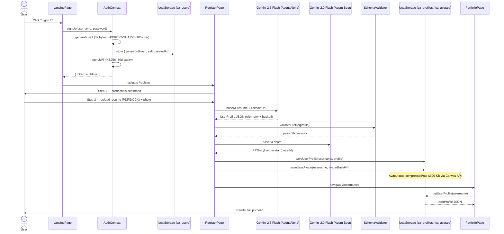
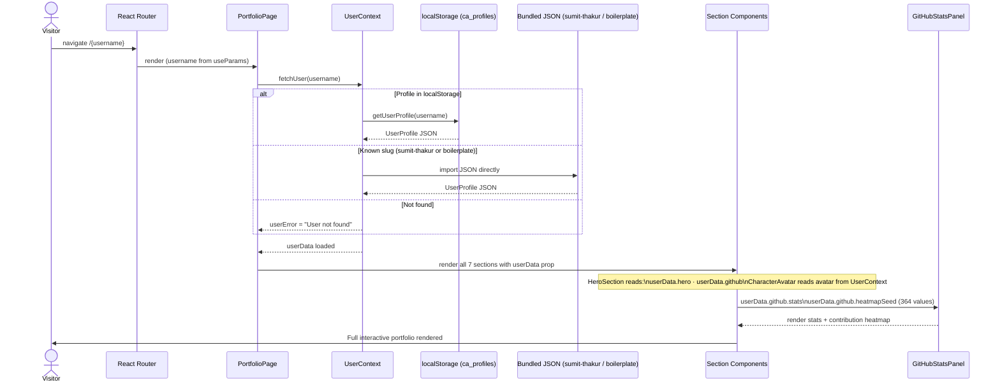
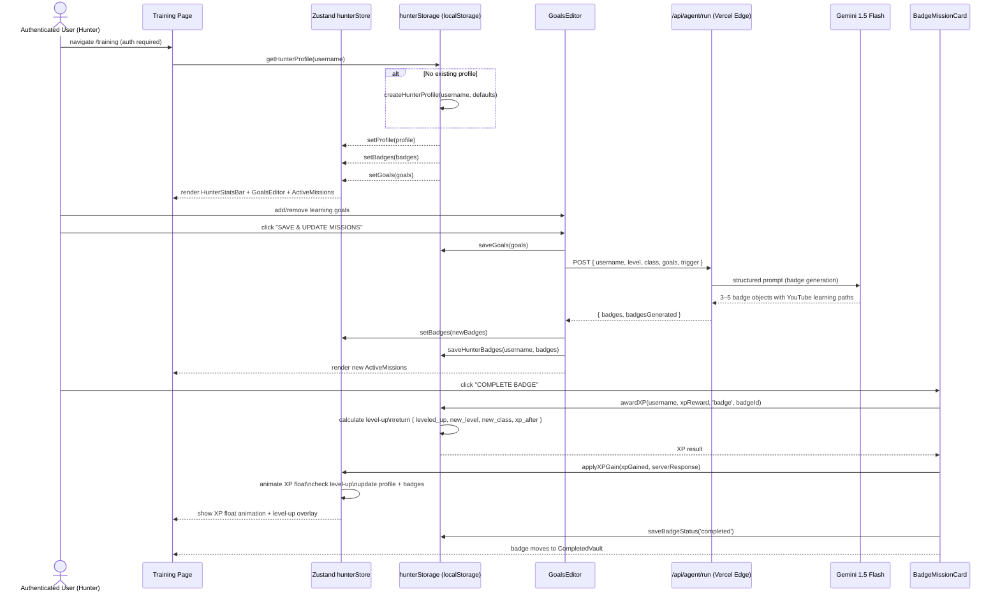
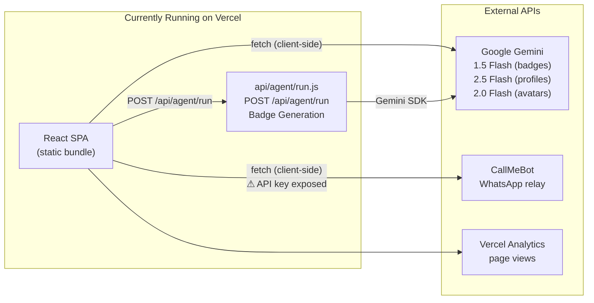
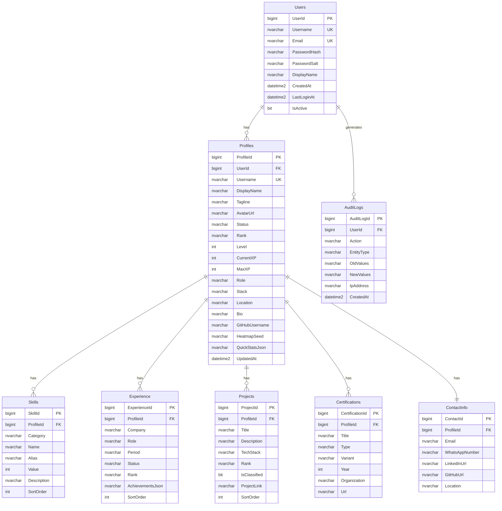
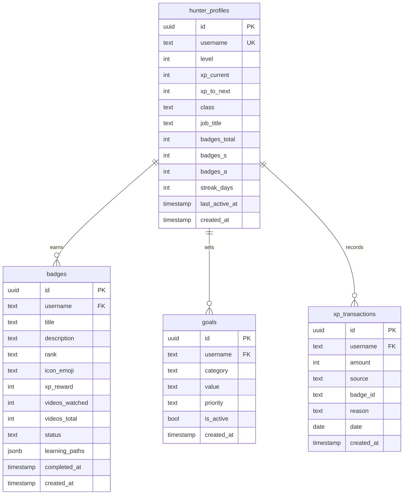
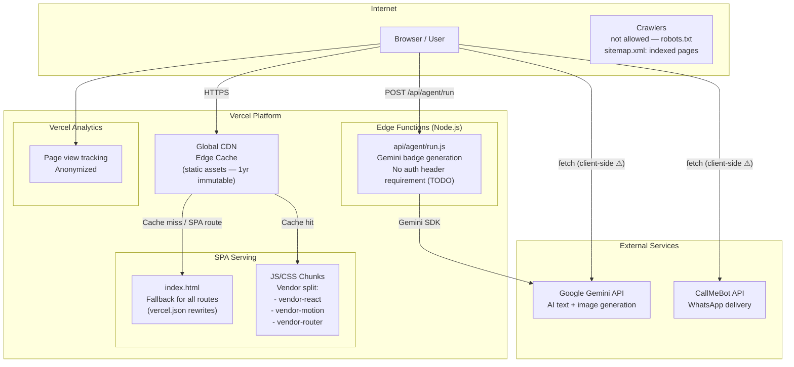

# CodeAether — System Architecture

**Version**: 1.0  
**Date**: April 15, 2026  
**Status**: Current implementation documented; planned backend sections marked accordingly

---

## Table of Contents

1. [System Overview](#1-system-overview)
2. [Frontend Module Map](#2-frontend-module-map)
3. [Data Flow Diagrams](#3-data-flow-diagrams)
   - [3.1 Registration Flow](#31-registration-flow)
   - [3.2 Portfolio View Flow](#32-portfolio-view-flow)
   - [3.3 Training Flow](#33-training-flow)
4. [Backend Module Map](#4-backend-module-map)
5. [Database Schema](#5-database-schema)
6. [Security Layer](#6-security-layer)
7. [Deployment Architecture](#7-deployment-architecture)
8. [Environment Variables](#8-environment-variables)

---

## 1. System Overview

CodeAether is an RPG-themed developer portfolio platform where users register, have an AI generate their portfolio from a resume, and level up through a gamified training system.

### High-Level Components

```
┌──────────────────────────────────────────────────────────────────────┐
│                          VERCEL (Production)                         │
│                                                                      │
│  ┌─────────────────────────────────┐   ┌──────────────────────────┐ │
│  │       React SPA (Frontend)      │   │   Edge Functions (API)   │ │
│  │  Vite + React 19 + Framer Motion│   │   api/agent/run.js       │ │
│  │  Zustand + React Context        │   │   (badge generation)     │ │
│  └─────────────┬───────────────────┘   └──────────┬───────────────┘ │
└────────────────┼──────────────────────────────────┼─────────────────┘
                 │                                  │
         ┌───────▼──────────────────────────────────▼───────┐
         │                 External APIs                     │
         │  ┌──────────────┐  ┌──────────┐  ┌───────────┐  │
         │  │ Google Gemini│  │CallMeBot │  │  Vercel   │  │
         │  │  (AI agents) │  │(WhatsApp)│  │ Analytics │  │
         │  └──────────────┘  └──────────┘  └───────────┘  │
         └───────────────────────────────────────────────────┘

         ┌───────────────────────────────────────────────────┐
         │              Client localStorage                   │
         │  ca_users (auth registry)                          │
         │  ca_profiles (portfolio + training unified JSON)   │
         │  ca_avatars (base64 avatar assets)                 │
         └───────────────────────────────────────────────────┘
```

### Technology Stack

| Layer | Technology | Version |
|-------|-----------|---------|
| UI Framework | React | 19.2.4 |
| Build Tool | Vite | 8.x |
| Animations | Framer Motion | 12.x |
| Routing | React Router DOM | 7.x |
| Global State | Zustand | 5.x |
| Forms | React Hook Form + Zod | 7.x / 4.x |
| Icons | Lucide React | 1.x |
| Auth (client) | jose (JWT) | 6.x |
| AI (client) | @google/generative-ai | 0.24.x |
| Analytics | @vercel/analytics | 2.x |
| Deployment | Vercel | — |
| Backend (AI) | Vercel Edge Functions | — |

---

## 2. Frontend Module Map

```mermaid
graph TD
    subgraph Entry
        main["main.jsx\nseeds localStorage\nrenders App"]
        App["App.jsx\nProviders + Router\nLazy page loading"]
    end

    subgraph Providers["React Providers (Context)"]
        AuthCtx["AuthContext\n─────────────\nstate: authUser, isAuthenticated\nfns: signIn, signUp, signOut\ncrypto: PBKDF2 + HS256 JWT"]
        UserCtx["UserContext\n─────────────\nstate: userData, userAvatar\nfns: fetchUser, setLiveProfile\nsource: localStorage → bundled JSON"]
        AudioCtx["AudioContext\n─────────────\nstate: playing, ready\nfns: play, pause, toggle\nasset: dark_aria.mp3"]
    end

    subgraph Store["Zustand Store"]
        HunterStore["hunterStore\n─────────────\nprofile · badges · goals\npendingXPFloats · levelUpData\ntoasts · agentRunning"]
    end

    subgraph Pages
        Landing["LandingPage /\nAuth modal\nSign in / Sign up"]
        Register["RegisterPage /register\nStep 1: credentials\nStep 2: resume + photo → AI"]
        Portfolio["PortfolioPage /:username /demo\n7 section portfolio viewer"]
        Training["Training /training\nHunter progression\nGoals → Missions → XP"]
        Legal["Legal Pages\n/privacy-policy\n/terms-of-use\n/cookie-policy"]
    end

    subgraph LayoutComponents["Layout Components"]
        Nav["Navigation\nsidebar + mobile\naudio toggle"]
        Footer["Footer\ncopyright · social · legal links"]
        LoadingScreen["LoadingScreen\nterminal phase animation"]
        CookieBanner["CookieBanner\nlocalStorage: cookie-accepted"]
        SystemCursor["SystemCursor\nspring cursor tracking"]
        PageTransition["PageTransition\nroute fade/slide/blur"]
    end

    subgraph SectionComponents["Portfolio Section Components"]
        Hero["HeroSection\nXP panel · GitHub stats\ncharacter avatar + display"]
        About["AboutSection\nbio · profile fields · quick stats"]
        Skills["SkillsSection\nflip cards · proficiency bars"]
        Experience["ExperienceSection\nquest log timeline"]
        Projects["ProjectsSection\ndungeon cards · classified unlock"]
        Certs["CertificationsSection\nbadge grid"]
        Contact["ContactSection\nform → WhatsApp relay"]
    end

    subgraph TrainingComponents["Training Components"]
        StatsBar["HunterStatsBar\nlevel · class · XP · streak"]
        GoalsEditor["GoalsEditor\nadd/remove goals\ntriggers /api/agent/run"]
        ActiveMissions["ActiveMissions\nbadge list → BadgeMissionCard"]
        BadgeCard["BadgeMissionCard\nexpandable · progress · complete"]
        CompletedVault["CompletedVault\narchived badges"]
    end

    subgraph UIComponents["Reusable UI Components"]
        CharAvatar["CharacterAvatar\nhex portrait"]
        CharDisplay["CharacterDisplay\nCSS atmospheric effects"]
        GitHubPanel["GitHubStatsPanel\nstats + heatmap grid"]
        GlowBtn["GlowButton\nspring-animated button"]
        RankBadge["RankBadge\nE–S rank label"]
        RevealScroll["RevealOnScroll\nIntersectionObserver reveal"]
        StatBar["StatBar\nanimated progress bar"]
        SysPanel["SystemPanel\nstyled wrapper div"]
        SysText["SystemText\ntypewriter effect"]
        XPPanel["XPProgressPanel\nlevel · XP bar · rank ladder"]
    end

    subgraph Utils["Utilities"]
        UserStorage["userStorage.js\nca_users · ca_profiles · ca_avatars"]
        GeminiAgents["geminiAgents.js\nAgent Alpha: resume → profile\nAgent Beta: photo → avatar"]
        SchemaValidator["schemaValidator.js\nvalidates UserProfile JSON"]
        WhatsApp["whatsapp.js\nCallMeBot relay"]
        HunterStorage["hunterStorage.js\nca_profiles[username].training\nbadges · goals · XP ledger"]
    end

    subgraph Data["Static Data"]
        Schema["schema.js\nRankEnum · StatusEnum\nTypeScript-style JSDoc"]
        Sumit["sumit-thakur.json\nreal S-rank demo profile"]
        Boilerplate["boilerplate.json\ntemplate welcome profile"]
    end

    main --> App
    App --> AuthCtx & UserCtx & AudioCtx
    App --> Landing & Register & Portfolio & Training & Legal
    App --> Nav & CookieBanner & SystemCursor

    Landing --> AuthCtx
    Register --> AuthCtx & GeminiAgents & UserStorage & SchemaValidator
    Portfolio --> UserCtx & Hero & About & Skills & Experience & Projects & Certs & Contact & Nav & Footer
    Training --> AuthCtx & HunterStore & StatsBar & GoalsEditor & ActiveMissions & CompletedVault & Nav

    Hero --> CharAvatar & CharDisplay & XPPanel & GitHubPanel & UserCtx & AudioCtx
    About --> SysPanel & RevealScroll & UserCtx
    Skills --> StatBar & RevealScroll & UserCtx
    Experience --> RankBadge & RevealScroll & UserCtx
    Projects --> RankBadge & GlowBtn & RevealScroll & UserCtx
    Certs --> RevealScroll & UserCtx
    Contact --> SysPanel & GlowBtn & RevealScroll & WhatsApp & UserCtx

    StatsBar --> HunterStore & HunterStorage
    GoalsEditor --> HunterStore & HunterStorage & GlowBtn
    ActiveMissions --> HunterStore & BadgeCard
    BadgeCard --> HunterStore & HunterStorage & GlowBtn
    CompletedVault --> HunterStore

    AuthCtx --> UserStorage
    UserCtx --> UserStorage & Sumit & Boilerplate
    UserStorage --> Schema
    GeminiAgents --> SchemaValidator
    SchemaValidator --> Schema
```



---

## 3. Data Flow Diagrams

### 3.1 Registration Flow



### 3.2 Portfolio View Flow



### 3.3 Training Flow



Storage details:
- `hunterStorage` reads and writes training data via `ca_profiles[username].training`.
- `awardXP()` and all profile saves mirror level/rank/xp into `profile.hero` so Portfolio and Training stay consistent.
- Legacy `hunter_*` keys are migration inputs only (cleaned at app bootstrap), not active runtime storage.

---

## 4. Backend Module Map

### Current Backend (Live)



### Planned Backend Architecture

```mermaid
graph TD
    subgraph Frontend["React SPA"]
        FE_Auth["Auth flows"]
        FE_Reg["Registration"]
        FE_Port["Portfolio viewer"]
        FE_Train["Training page"]
        FE_Contact["Contact form"]
    end

    subgraph VercelEdge["Vercel Edge Functions"]
        E_Badge["POST /api/agent/run\nBadge generation (Gemini 1.5)"]
        E_Profile["POST /api/ai/generate-profile\nAgent Alpha (Gemini 2.5)"]
        E_Avatar["POST /api/ai/generate-avatar\nAgent Beta (Gemini 2.0)"]
        E_Contact["POST /api/contact/send\nWhatsApp relay (CallMeBot)"]
    end

    subgraph ASPNET["ASP .NET Core 7 API"]
        A_Auth["Auth endpoints\n/api/auth/register\n/api/auth/signin\n/api/auth/refresh\n/api/auth/logout"]
        A_Profiles["Profile endpoints\n/api/profiles CRUD\n/api/avatars serve"]
        A_Avatar["Avatar upload\n/api/profiles/{u}/avatar"]
    end

    subgraph Supabase["Supabase (PostgreSQL + Realtime)"]
        S_Hunter["hunter_profiles table"]
        S_Badges["badges table"]
        S_Goals["goals table"]
        S_XP["xp_transactions table"]
    end

    subgraph Storage["File Storage"]
        Blob["Vercel Blob\navatars storage"]
        Temp["Temp storage\nresumes (deleted post-AI)"]
    end

    subgraph DBs["Databases"]
        SQL["SQL Server\nUsers + Profiles\nSkills + Experience\nProjects + Certs"]
    end

    FE_Reg -->|"resume + photo"| E_Profile & E_Avatar
    FE_Reg -->|"profile JSON + avatar"| A_Profiles
    FE_Auth -->|"credentials"| A_Auth
    FE_Port -->|"GET /api/profiles/:u"| A_Profiles
    FE_Train -->|"POST goals"| E_Badge
    FE_Train -->|"hunter CRUD"| S_Hunter & S_Badges & S_Goals & S_XP
    FE_Contact -->|"form data"| E_Contact

    E_Profile & E_Avatar -->|"Gemini SDK"| GeminiCloud["Google Gemini"]
    E_Badge -->|"Gemini SDK"| GeminiCloud
    E_Contact -->|"HTTP"| CallMeBotCloud["CallMeBot"]

    A_Auth & A_Profiles & A_Avatar --> SQL
    A_Avatar -->|"binary upload"| Blob
```



---

## 5. Database Schema

### Current: localStorage Keys

```
localStorage
├── ca_users
│   └── { [username]: { passwordHash, salt, createdAt } }
│
├── ca_profiles
│   └── { [username]: UserProfile }   — full JSON profile
│
└── ca_avatars
    └── { [username]: "data:image/jpeg;base64,..." }   — ≤300 KB

UserProfile structure:
├── meta         { slug, displayName, tagline, rank, level }
├── hero         { xp, firstName, lastName, role, stack, location, alertText }
├── about        { bio[], profileFields[], quickStats[] }
├── skills[]     { category, icon, skills[{ name, alias, value, desc }] }
├── experience[] { rank, guild, role, period, location, status, achievements[] }
├── projects[]   { rank, title, tech, desc, classified, link }
├── certifications[] { variant, type, title, year }
├── contact      { email, whatsappNumber, linkedin, location }
├── github       { username, stats[], heatmapSeed[364] }
└── training
    ├── fields   { username, level, xp_current, xp_to_next, class, job_title, ... }
    ├── badges[] { id, title, description, rank, xp_reward, status, videos_watched, ... }
    ├── goals[]  { id, category, value, priority, is_active, created_at }
    ├── xp_ledger[] { id, amount, source_type, source_id, xp_before, xp_after, leveled_up, ... }
    └── agent_log { lastRun, trigger, badgesGenerated }

Mirror invariant:
- `profile.training.level/class/xp_current/xp_to_next` is mirrored into `profile.hero.level/rank/xp.current/xp.max` on write.

Legacy migration (startup, idempotent):
- If old keys like `hunter_profile_{username}`, `hunter_badges_{username}`, `hunter_goals_{username}`, `hunter_xp_ledger_{username}` exist, they are merged into `ca_profiles[username].training` and removed.
- After migration, active runtime keys remain: `ca_users`, `ca_profiles`, `ca_avatars`.
```

### Planned: SQL Server (User & Profile Data)



### Planned: Supabase PostgreSQL (Training Data)



---

## 6. Security Layer

### Authentication & Cryptography

| Mechanism | Current (Client-Side) | Planned (Server-Side) |
|-----------|----------------------|----------------------|
| Password hashing | PBKDF2-SHA256, 100k iterations, 32-byte salt | Same — moved server-side |
| JWT signing | HS256, hardcoded secret in browser | HS256 or RS256, secret in env var server-only |
| JWT storage | `localStorage` + cookie (HttpOnly intent) | `HttpOnly` cookie only (XSS-safe) |
| Token expiry | 30 days | 1h access + 30d refresh with rotation |
| Session verification | Self-verification in browser | Server middleware on every request |

### Transport Security (Vercel — Currently Active)

The `vercel.json` enforces these headers on **all responses**:

```
Strict-Transport-Security: max-age=63072000; includeSubDomains; preload
X-Content-Type-Options: nosniff
X-Frame-Options: DENY
Referrer-Policy: strict-origin-when-cross-origin
Permissions-Policy: camera=(), microphone=(), geolocation=()
Content-Security-Policy: default-src 'self'; ...
```

Static assets cached with `Cache-Control: public, max-age=31536000, immutable`.

### Input Sanitization

| Component | Sanitization Applied |
|-----------|---------------------|
| `whatsapp.js` | Strips `<>`, truncates name (50), email (100), message (1000) |
| `geminiAgents.js` | Validates extracted profile against `schemaValidator.js` |
| `schemaValidator.js` | Validates enums, required fields, array shapes |
| Contact form | Zod schema via `react-hook-form` + `@hookform/resolvers` |
| `userStorage.js` | No sanitization — must add on server-side migration |

### API Key Security

| Key | Current State | Risk | Fix |
|-----|--------------|------|-----|
| `GEMINI_API_KEY` | In browser via `geminiAgents.js` | HIGH — quota theft | Move to Edge Functions |
| `WHATSAPP_PHONE` | In browser via `whatsapp.js` | LOW — phone number visible | Move to Edge Function |
| `WHATSAPP_API_KEY` | In browser via `whatsapp.js` | HIGH — spam abuse | Move to Edge Function |
| `GEMINI_API_KEY` (badge) | In Edge Function via env var | SAFE | Already server-side ✓ |

### CORS Policy (Planned)

```
Allowed Origins: https://codeaether.com, http://localhost:5173
Allowed Methods: GET, POST, PUT, DELETE, OPTIONS
Allowed Headers: Content-Type, Authorization
Max Age: 86400
Credentials: true (for cookies)
```

---

## 7. Deployment Architecture



### Route Map

| URL Pattern | Serves | Auth Required |
|-------------|--------|--------------|
| `/` | LandingPage | No |
| `/register` | RegisterPage | No (post sign-up) |
| `/demo` | PortfolioPage (`boilerplate` profile) | No |
| `/training` | Training | Yes (redirects to `/` if unauthenticated) |
| `/privacy-policy` | PrivacyPolicy | No |
| `/terms-of-use` | TermsOfUse | No |
| `/cookie-policy` | CookiePolicy | No |
| `/:username` | PortfolioPage (dynamic lookup) | No |
| `/api/agent/run` | Edge Function | No (Vercel internal) |

### Caching Strategy

| Asset Type | Cache-Control | TTL |
|-----------|--------------|-----|
| JS/CSS chunks (hashed names) | `public, max-age=31536000, immutable` | 1 year |
| Fonts | `public, max-age=31536000, immutable` | 1 year |
| Images in `/assets/` | `public, max-age=31536000, immutable` | 1 year |
| `index.html` | `no-cache` (forced by Vercel SPA mode) | 0 |
| `robots.txt`, `sitemap.xml` | `public, max-age=86400` | 1 day |
| API responses (`/api/*`) | `no-cache` | Always fresh |

### Build Process

```
npm run build
  └── vite build
        ├── Entry: index.html → src/main.jsx
        ├── Code splitting: lazy-loaded pages
        ├── Manual chunks:
        │   ├── vendor-react   (react, react-dom, react-router-dom)
        │   ├── vendor-motion  (framer-motion)
        │   └── vendor-router  (react-router)
        └── Output: dist/
              ├── index.html
              ├── assets/
              │   ├── *.js (hashed)
              │   └── *.css (hashed)
              └── [public/ files copied]
```

---

## 8. Environment Variables

### Active (Vercel Edge Function — currently required)

| Variable | Used By | Purpose |
|----------|---------|---------|
| `GEMINI_API_KEY` | `api/agent/run.js` | Google Gemini badge generation |

### In Browser — Must Move to Server (Security Risk)

| Variable | Currently In | Should Be In |
|----------|-------------|-------------|
| `GEMINI_API_KEY` | `src/utils/geminiAgents.js` | `api/ai/generate-profile.js` & `api/ai/generate-avatar.js` |
| `WHATSAPP_PHONE` | `src/utils/whatsapp.js` | `api/contact/send.js` |
| `WHATSAPP_API_KEY` | `src/utils/whatsapp.js` | `api/contact/send.js` |

### Full Production Set

| Variable | Service | Where to Set | Notes |
|----------|---------|-------------|-------|
| `GEMINI_API_KEY` | Google AI Studio | Vercel Env Vars | All environments |
| `JWT_SECRET` | ASP .NET Core Auth | Vercel / Azure Key Vault | Production only; min 64 chars |
| `WHATSAPP_PHONE` | CallMeBot | Vercel Env Vars | E.164 format: `+919876543210` |
| `WHATSAPP_API_KEY` | CallMeBot | Vercel Env Vars | From callmebot.com |
| `DATABASE_URL` | SQL Server | Vercel Env Vars | Connection string |
| `SUPABASE_URL` | Supabase | Vercel Env Vars | `https://xxx.supabase.co` |
| `SUPABASE_ANON_KEY` | Supabase (public) | Vercel Env Vars | Safe for browser |
| `SUPABASE_SERVICE_KEY` | Supabase (admin) | Vercel Env Vars | Server/Edge only — never browser |
| `BLOB_READ_WRITE_TOKEN` | Vercel Blob | Vercel Env Vars | Avatar storage |
| `ALLOWED_ORIGINS` | CORS | ASP .NET Core | `https://codeaether.com` |
| `VITE_SUPABASE_URL` | Frontend (future) | `.env.local` | Only if using Supabase client in browser |
| `VITE_SUPABASE_ANON_KEY` | Frontend (future) | `.env.local` | Anon key only (not service key) |

> **Rule:** Variables prefixed `VITE_` are bundled into the browser by Vite and are publicly visible. Never prefix secret keys with `VITE_`.
